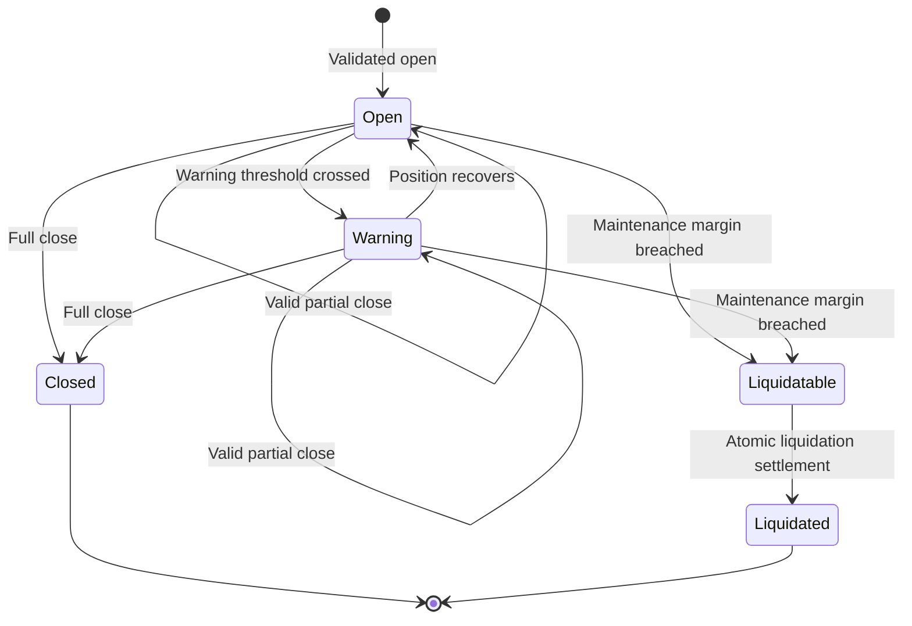

# AmpliDex Technical Architecture

### 1. Purpose and Scope

AmpliDex is a non-custodial leveraged-markets and liquidity protocol designed for Stellar Soroban.

Liquidity providers supply assets to isolated lending pools. Traders post collateral and borrow from those pools to create long or short exposure through approved Stellar execution venues. Interest accrues through pool-level borrow indexes, while positions remain subject to deterministic solvency rules at every relevant protocol transition and may be independently monitored for permissionless liquidation eligibility.

AmpliDex is designed around five production principles:

1. keep financial authority and settlement on Stellar/Soroban;
2. isolate markets and external dependencies so failures remain bounded;
3. constrain, delay, and expose privileged actions;
4. preserve permissionless repayment, exits, and liquidation wherever safe; and
5. allow EVM users to access Stellar-native positions without introducing backend custody.

The core production design covers:

* isolated lending pools;
* LP share accounting;
* indexed borrowing and interest accrual;
* leveraged long and short positions;
* bounded DEX execution;
* resilient pricing;
* deterministic solvency checks;
* permissionless liquidation;
* bad-debt accounting;
* indexing and query infrastructure;
* governance and upgrade controls; and
* production monitoring and operations.

USDC serves as the primary protocol quote and reporting denomination. Individual markets may additionally support borrowable non-USDC assets where required for short exposure.

### 2. Scope and Maturity

#### 2.1 Capability Register

The architecture describes the intended production system. A capability appearing in this document does not imply that it has been deployed, audited, or classified as production-ready.

| **Capability**                        | **Current Status** | **Production Scope**     | **Release Gate**                                   |
| ------------------------------------- | ------------------ | ------------------------ | -------------------------------------------------- |
| Lending pools and LP shares           | MVP validated      | Core launch              | Economic review and invariant tests                |
| Borrow-index accounting               | MVP validated      | Core launch              | Rounding, overflow, accrual, and time-jump tests   |
| Long and short positions              | MVP validated      | Core launch              | Lifecycle, solvency, and insolvency tests          |
| Add margin, repay, partial/full close | MVP validated      | Core launch              | State-machine and property tests                   |
| Aquarius execution                    | MVP validated      | Core launch              | Adapter review and production-route verification   |
| Keeper-assisted liquidation           | MVP validated      | Core launch              | Independent keeper and liquidation-race tests      |
| Soroswap integration                  | Proposed           | Production hardening     | Adapter integration and route-bound testing        |
| Route failover                        | Proposed           | Production hardening     | Bounded fallback and failure-mode testing          |
| Multi-source oracle router            | Proposed           | Production hardening     | Freshness, deviation, and degraded-mode testing    |
| Event indexer and query API           | Proposed           | Production hardening     | Replay, reconciliation, backup, and SLO validation |
| Direct liquidation market             | Proposed           | Post-core activation     | Economic review and capped rollout                 |
| EVM-controlled smart accounts         | Proposed           | Cross-chain extension    | Authentication and authorization review            |
| Circle CCTP integration               | Proposed           | Cross-chain extension    | Recovery, replay, and supported-domain validation  |
| Confidential positions                | Research           | Future opt-in capability | Circuit benchmarks and dedicated verifier audit    |

“MVP validated” reflects implementation or validation claims associated with the current project scope. Before external production claims are made, each relevant capability must be linked to verifiable evidence such as a repository release, deployed contract ID, automated test report, transaction record, review artifact, or reproducible build.

For canonical release status and supporting artifacts, see [**Production Readiness & Evidence**](production-readiness-and-evidence.md).

#### 2.2 Release Non-Goals

The production release does not target:

* replicated leveraged-position state across multiple chains;
* arbitrary user-supplied DEX contracts;
* arbitrary user-supplied execution routes;
* arbitrary user-supplied price feeds;
* backend custody;
* server-held user signing keys;
* uncapped permissionless market listing;
* guaranteed LP withdrawal liquidity during high utilization;
* complete transaction anonymity;
* unreviewed automatic contract upgrades; or
* hidden socialization of bad debt across unrelated markets.

## 3. System Context


The authoritative financial state remains on Stellar. Off-chain systems improve discovery, monitoring, transaction preparation, and automation but cannot redefine balances, debt, position health, or liquidation eligibility.

### 3.1 Trust Boundaries

| **Component**     | **Trusted For**                                     | **Not Trusted For**                                       |
| ----------------- | --------------------------------------------------- | --------------------------------------------------------- |
| Soroban contracts | Balances, debt, solvency, settlement, authorization | External prices without validation                        |
| Governance        | Bounded configuration and scheduled upgrades        | Arbitrary transfer of user or LP funds                    |
| Guardian          | Narrow emergency restrictions                       | Economic changes, fee changes, arbitrary balance mutation |
| DEX adapters      | Invoking registered execution venues                | Defining risk policy or weakening user bounds             |
| Oracle adapters   | Reference observations                              | Sole pricing authority when stale or divergent            |
| Indexer / API     | Discovery, history, analytics                       | Authoritative balances or liquidation eligibility         |
| Keepers           | Candidate discovery and transaction submission      | Deciding whether a position is liquidatable               |
| Frontend / SDK    | Transaction construction, simulation, signing flow  | Contract-level validation                                 |
| CCTP              | Native USDC transport                               | Synchronizing AmpliDex debt or position state             |
| Smart accounts    | Scoped user-authorized Soroban execution            | Protocol governance or custody outside user authorization |

## 4. Architecture Principles

#### Single settlement domain

Liquidity, debt, positions, fees, and liquidations settle on Stellar/Soroban.

#### On-chain authority; off-chain acceleration

Backends, indexers, APIs, keepers, and interfaces improve usability and liveness but cannot rewrite financial truth.

#### Fail closed for added risk

Unsafe oracle, route, liquidity, market-cap, or execution conditions reject new risk.

#### Preserve risk reduction

Repayment, margin addition, position reduction, close, and liquidation remain available whenever they can be performed safely.

#### Least privilege

Governance, guardian, deployer, keeper, CI, infrastructure, and operational identities are separate and narrowly scoped.

#### Deterministic execution

Protocol-managed assets interact only with registered adapters and bounded execution routes.

#### Market isolation

Risk caps, pools, pricing rules, routes, liquidation behavior, and emergency controls are defined per market.

#### Atomicity and idempotency

On-chain financial transitions are atomic. Off-chain event processing is replay-safe and idempotent.

#### Explicit failure domains

A failure in a DEX, oracle, keeper, indexer, RPC provider, bridge, or staged extension must not implicitly corrupt unrelated market accounting.

#### Measurable operations

Safety-relevant signals have explicit metrics, owners, alert thresholds, and runbooks.

## 5. On-Chain Architecture

### 5.1 Contract Topology

```
AmpliDex Core
├── Market registry and configuration
├── Lending and LP accounting
├── Borrow and interest accounting
├── Position state machine
├── Risk evaluation
├── Settlement
└── Fee accounting


Execution Router
├── Aquarius adapter
├── Soroswap adapter
└── Governed route registry


Oracle Router
├── Primary reference adapter
├── Secondary reference adapter
├── Normalization logic
└── Validation / degraded-mode policy


Liquidation Engine
├── Eligibility evaluation
├── Liquidation quote construction
├── Direct buyer settlement
└── Keeper-assisted settlement


Extensions
├── Smart Account Factory
├── EVM-controlled Soroban account
└── CCTP ingress / egress integration
```

Accounting that shares critical invariants remains atomic within the authoritative protocol state transition.

External integrations are isolated behind narrow interfaces.

Whether routers or subsystems are implemented as separately deployed contracts or internal contract modules is a deployment decision. Authorization boundaries, upgrade boundaries, storage ownership, and failure assumptions are documented in either case.

### 5.2 Canonical Records

```
GlobalConfig
protocol version, governance roles, guardian

MarketConfig(asset)
status, caps, margin parameters, routes, oracle policy

PoolState(asset)
cash, total borrows, reserves, total shares, borrow index

LpBalance(asset, account)
LP share ownership

Position(position_id)
owner, market, side, collateral, debt, holdings, status, version

OwnerPosition(owner, ...)
bounded position-discovery index where practical

RouteConfig(route_id)
venue, adapter, asset path, limits, priority, status

OraclePolicy(market)
sources, freshness bounds, deviation threshold, degraded behavior
```

Storage migrations are:

* versioned;
* bounded;
* idempotent;
* migration-order aware; and
* tested against serialized production-shaped state.

Existing enum variants are never reordered.

Every deployed release records:

* source commit;
* release tag;
* compiler and toolchain versions;
* reproducible WASM hash;
* Stellar network;
* contract ID;
* migration version;
* deployment configuration; and
* governance authorization transaction.

### 5.3 Market Configuration

Each market defines:

* enabled operations;
* emergency state;
* base and quote assets;
* asset decimal scales;
* pool supply cap;
* borrow cap;
* utilization limits;
* maximum position size;
* market open-interest cap;
* maximum borrow multiplier;
* warning margin;
* maintenance margin;
* opening fee;
* closing fee;
* reserve factor;
* liquidation fee or incentive;
* approved execution routes;
* maximum route hops;
* route liquidity floors;
* user and protocol slippage limits;
* approved reference-price sources;
* maximum oracle age;
* price-deviation threshold;
* degraded-mode policy;
* minimum position size; and
* minimum residual-position size.

Configuration updates validate internal consistency.

For example:

```
warning_margin > maintenance_margin
maintenance_margin > 0
max_borrow_multiplier <= protocol_maximum
route_slippage <= protocol_maximum_slippage
```

Configuration changes may not retroactively mutate existing user balances, LP shares, or recognized debt.

## 6. Economic Model

### 6.1 Pool and LP Accounting

For an established pool, deposits mint LP shares using the pre-deposit exchange rate:

```
shares_minted =
floor(
  deposit_assets × total_shares
  / total_assets_before
)
```

The economic value represented by LP shares is:

```
assets_owned =
floor(
  user_shares × total_assets
  / total_shares
)
```

Immediately withdrawable cash is bounded by available pool liquidity:

```
available_cash =
token_balance - reserved_outflows
```

```
assets_redeemed <=
min(
  assets_owned,
  available_cash
)
```

The economic specification must explicitly define:

* empty-pool initialization;
* minimum initial liquidity;
* donation behavior;
* share-price manipulation protections;
* deposit rounding direction;
* withdrawal rounding direction;
* dust handling;
* token decimal normalization;
* fee-on-transfer token rejection;
* reserve treatment;
* loss realization; and
* behavior when losses reduce the LP exchange rate.

The interface must distinguish **economic ownership** from **immediately withdrawable liquidity**.

### 6.2 Debt and Interest

Debt is represented through a pool-level borrow index.

Conceptually:

```
scaled_debt =
ceil(
  borrow_amount × INDEX_SCALE
  / borrow_index_at_borrow
)
```

Current debt is:

```
current_debt =
ceil(
  scaled_debt × current_borrow_index
  / INDEX_SCALE
)
```

Borrowing and repayment round conservatively so debt cannot disappear through truncation.

Interest accrual is bounded by:

* elapsed-time limits;
* fixed-point arithmetic limits;
* maximum configured interest rate;
* overflow-safe multiplication/division; and
* defined maximum accrual intervals.

Accrual occurs before every operation that reads or mutates authoritative pool debt.

Utilization is conceptually:

```
U =
total_borrowed / total_assets
```

A kinked annualized borrow-rate model may be represented as:

```
if U <= U_optimal:

    rate =
      base
      + slope_1 × U / U_optimal

else:

    rate =
      base
      + slope_1
      + slope_2 × (U - U_optimal) / (1 - U_optimal)
```

For intuition only, supply rate may be approximated as:

```
supply_rate ≈
borrow_rate × U × (1 - reserve_factor)
```

The exact implementation specifies:

* time basis;
* compounding convention;
* fixed-point scale;
* interest-accrual granularity;
* maximum rate;
* reserve accounting;
* rounding direction; and
* reference test vectors.

These are normative economic parameters, not implicit implementation details.

### 6.3 Leverage Semantics

AmpliDex uses **borrow multiplier**, not gross-exposure multiplier.

```
borrowed_notional =
collateral × borrow_multiplier
```

Collateral remains committed as loss-absorbing margin and is not included\
in the initial traded notional.

For a fully deployed position:

position\_exposure = borrowed\_notional

Example:

```
Collateral / margin:  1,000 USDC
Borrow multiplier:    5.0×
Borrowed notional:    5,000 USDC
Position exposure:    5,000 USDC
```

The contract, SDK, interface, documentation, and risk disclosures use this terminology consistently.

### 6.4 Position State Machine



A long position borrows USDC and acquires the market asset.

A short position borrows the market asset and sells it into USDC or the configured quote asset.

Every open or increase operation validates, within the authoritative transaction:

* market status;
* user authorization;
* collateral;
* pool capacity;
* borrow cap;
* position cap;
* open-interest cap;
* price environment;
* execution-route bounds;
* route liquidity;
* realized balance changes;
* resulting holdings;
* fees; and
* resulting margin.

A position may not be opened or increased into an immediately liquidatable state.

Partial close allocates:

* collateral;
* holdings;
* debt;
* realized PnL;
* protocol fees; and
* residual state

using explicitly tested rounding rules.

A partial close rejects a residual position that is:

* dust-sized;
* structurally invalid;
* outside current caps;
* under minimum collateral requirements; or
* immediately liquidatable.

A full close repays current debt and required fees, returns eligible surplus to the owner, and permanently transitions the position to `Closed`.

#### 6.5 Position Risk Calculation

Risk evaluation considers both independent reference pricing and realizable execution value.

Collateral remains committed as loss-absorbing margin and is accounted for separately from the assets or proceeds representing the leveraged position.

For a long position:

```
long_equity =
    collateral
    + conservative_sale_value(held_asset)
    - current_debt
    - estimated_close_costs
```

For a short position:

```
short_equity =
    collateral
    + held_sale_proceeds
    - conservative_repurchase_cost(current_debt_asset)
    - estimated_close_costs
```

At position opening, initial position exposure is the borrowed notional deployed into the trade:

```
initial_position_exposure =
    borrowed_notional
```

Current position exposure is determined from the conservative current value of the leveraged position.

For a long:

```
long_current_exposure =
    conservative_sale_value(held_asset)
```

For a short:

```
short_current_exposure =
    conservative_repurchase_value(current_debt_asset)
```

Margin is conceptually:

```
margin_ratio =
    equity / current_position_exposure
```

The protocol uses the more conservative valid valuation where multiple relevant reference or executable values are available.

For example, a position opened with 1,000 USDC of collateral and a 5.0× borrow multiplier has 5,000 USDC of initial position exposure. The 1,000 USDC collateral remains as margin and is not included in the initial traded notional.

If a long position subsequently falls from 5,000 USDC to a conservative realizable value of 4,500 USDC, ignoring interest and closing costs:

```
equity =
    1,000
    + 4,500
    - 5,000
    = 500 USDC

current_position_exposure =
    4,500 USDC

margin_ratio =
    500 / 4,500
    ≈ 11.11%
```

Interest, execution costs, and applicable fees further reduce equity and are included when determining the actual margin ratio.

The normative economic specification defines:

* initial position exposure;
* current position exposure;
* positive and negative equity;
* treatment of collateral;
* treatment of short-sale proceeds;
* valuation units;
* margin denominator;
* warning and maintenance-margin thresholds;
* liquidation equality conditions;
* accrued-interest treatment;
* fee ordering;
* liquidation incentive priority;
* decimal normalization;
* rounding direction;
* residual collateral;
* negative-value handling; and
* behavior when no executable quote exists.

The **Soroban contract**, not the indexer, keeper, query API, or frontend, makes the final solvency and liquidation determination.

## 7. Execution and Pricing

### 7.1 Execution Router

The AmpliDex Core invokes only execution routes registered through governed configuration.

A route binds:

* market;
* direction;
* adapter;
* venue;
* input asset;
* output asset;
* path;
* maximum hops;
* quote expiration;
* liquidity floor;
* protocol slippage ceiling;
* optional route priority; and
* enabled status.

Adapters expose narrow operations such as:

```
quote_exact_input(...)
execute_exact_input(...)

quote_exact_output(...)
execute_exact_output(...)
```

A transaction succeeds only when the selected route:

1. is enabled;
2. matches the expected market and asset direction;
3. uses an approved adapter;
4. stays inside the user-signed maximum input or minimum output;
5. stays inside protocol-level slippage limits;
6. stays inside configured price-deviation limits;
7. satisfies freshness requirements;
8. meets configured liquidity requirements; and
9. produces an actual balance delta consistent with the executed operation.

User-signed bounds and protocol bounds are independent.

A retry may choose another approved route but may never loosen either set of constraints.

Fallback execution occurs across separately simulated and authorized attempts unless the complete fallback path can be proven atomic and deterministic within a single transaction.

***

### 7.2 Oracle Router

AmpliDex distinguishes between two pricing concepts.

#### Reference price

An independent, freshness-checked observation used for:

* solvency;
* margin evaluation;
* circuit breakers;
* price-deviation checks; and
* risk controls.

#### Executable price

A conservative approved-route quote used to estimate:

* realizable sale value;
* asset repurchase cost;
* liquidation proceeds;
* closing cost; and
* execution viability.

All sources are normalized to a documented fixed-point scale.

They are checked for:

* ledger or timestamp freshness;
* decimal normalization;
* source validity;
* cross-source deviation;
* route/reference deviation; and
* configured market policy.

Material disagreement is not averaged away.

#### Degraded Pricing Behavior

| **Pricing Condition**             | **New Exposure**              | **Repayment / Add Margin** | **Close / Risk Reduction**                   | **Liquidation**                               |
| --------------------------------- | ----------------------------- | -------------------------- | -------------------------------------------- | --------------------------------------------- |
| Healthy sources                   | Enabled                       | Enabled                    | Enabled                                      | Enabled                                       |
| One source stale                  | Market-policy dependent       | Enabled                    | Conservative route bounds                    | Conservative policy                           |
| Material source disagreement      | Disabled                      | Enabled                    | Risk-reducing path only                      | Restricted / predefined policy                |
| All reference sources unavailable | Disabled                      | Enabled                    | Emergency-exit policy                        | Predefined emergency policy                   |
| Route unavailable                 | Disabled where route required | Enabled                    | Alternate approved route or emergency policy | Alternate approved route or predefined policy |

Exact behavior is defined per market before activation.

An oracle incident never silently substitute an unbounded spot price.

## 8. Liquidation and Bad Debt

### 8.1 Liquidation Eligibility

Liquidation eligibility is recalculated atomically in the settlement transaction.

A keeper or liquidation buyer may identify and submit a candidate position, but cannot force a healthy position to liquidate.

No off-chain service has authority to override on-chain eligibility.

### 8.2 Liquidation Quote

A liquidation quote binds, where applicable:

* position ID;
* position version;
* market;
* required buyer payment;
* debt principal;
* accrued interest;
* protocol fees;
* liquidation incentive;
* collateral delivered;
* reference price;
* executable price;
* quote ledger;
* expiry; and
* relevant route constraints.

A buyer signs bounded terms such as:

```
max_payment
min_collateral_received
expiry
position_version
```

Settlement rechecks:

* authorization;
* current position version;
* current position health;
* quote validity;
* debt;
* fees;
* route bounds;
* payment;
* collateral delivery; and
* market state.

A successful liquidation:

1. collects settlement value;
2. repays the affected lending pool;
3. distributes only configured and permitted fees;
4. returns any eligible residual surplus to the position owner; and
5. marks the position as `Liquidated`.

### 8.3 Keeper Model

Keepers provide automation and liveness but are not protocol authorities.

Multiple independent keepers may:

* discover risky positions;
* simulate liquidation;
* submit liquidation transactions;
* rebroadcast after RPC failure; and
* monitor execution.

Keeper keys:

* do not control governance;
* do not control user accounts;
* do not decide liquidation eligibility;
* hold only bounded operating balances; and
* can be replaced without changing protocol solvency rules.

Permissionless third parties may submit valid liquidation transactions independently of AmpliDex-operated keepers.

### 8.4 Bad Debt

Bad debt is recognized only after position-held assets and collateral have been exhausted.

The intended loss waterfall is:

```
Position-held assets
        ↓
Position collateral
        ↓
Designated insurance reserve, if enabled
        ↓
Affected isolated pool loss
```

Losses are explicit in contract state and emitted events.

They are never silently assigned to unrelated markets or pools.

If insurance is enabled, it has explicit:

* balances;
* contribution rules;
* per-market limits;
* global limits;
* epoch payout limits; and
* governance controls.

## 9. Off-Chain Platform

### 9.1 Event Indexer

Soroban contract events feed a replayable indexer with a durable ledger checkpoint.

Event rows use deterministic identities such as:

```
(network, transaction_hash, event_index)
```

Event persistence and checkpoint advancement occur in one database transaction.

The indexer supports derived views for:

* account positions;
* pool activity;
* market history;
* utilization;
* liquidations;
* fees;
* execution activity;
* protocol metrics; and
* staged cross-chain status.

The indexer:

* resumes from the last durable checkpoint;
* tolerates duplicate event delivery;
* handles supported Stellar history semantics;
* detects gaps;
* replays deterministically;
* reconciles materialized state against contract reads; and
* exposes lag and reconciliation metrics.

Indexed state is never authoritative for financial transitions.

### 9.2 Query API

The query API is:

* versioned;
* read-oriented;
* paginated;
* rate-limited;
* cache-aware; and
* non-authoritative.

A canonical public path may use:

```
/v1/...
```

The API supports:

* markets;
* pools;
* positions;
* account history;
* liquidations;
* protocol metrics;
* route status;
* analytics; and
* cross-chain status where applicable.

Quote endpoints are advisory.

Any transaction derived from API data is simulated and revalidated against authoritative on-chain state before signing or submission.

### 9.3 Frontend and SDK

The non-custodial client is responsible for:

* wallet connection;
* market discovery;
* authoritative state refresh;
* transaction construction;
* simulation;
* signing;
* submission;
* lifecycle feedback; and
* failure recovery guidance.

A backend never signs financial transactions on behalf of the user.

Data precedence is:

1. **contract state** for balances, debt, configuration, position status, and eligibility;
2. **current simulation** for transaction-specific effects and resource costs; and
3. **indexed data** for discovery, history, and analytics.

SDK modules may include:

```
markets
pools
positions
liquidation
pricing
execution
simulation
contract bindings
smart accounts
CCTP
```

Generated bindings are pinned to compatible contract versions.

Clients fail explicitly when connected to an unsupported protocol version.

## 10. Cross-Chain Access

### 10.1 EVM-Controlled Soroban Smart Accounts

An EVM-controlled Soroban smart account may hold Stellar assets and authorize scoped Soroban invocations after validating an EVM signature.

An authorization binds at minimum:

* EVM signer;
* Stellar network passphrase;
* smart-account address;
* target contract;
* invocation tree or invocation hash;
* nonce;
* validity window; and
* account implementation version.

Nonces are single-use.

Signer rotation and recovery are explicit privileged flows with separate authorization requirements.

The EVM wallet controls a **Stellar-resident account**. It does not cause AmpliDex position state to exist on an EVM chain.

### 10.2 Circle CCTP

Circle CCTP transports native USDC to and from the user-controlled Stellar account.

CCTP does **not** transport:

* AmpliDex position state;
* debt;
* LP shares;
* liquidation state; or
* protocol governance state.

The bridge and trade are separate state machines.

Ingress:

```
EVM user authorizes CCTP transfer
        ↓
Source-chain approval / burn
        ↓
Message finality
        ↓
Circle attestation
        ↓
Destination mint on Stellar
        ↓
USDC held by user-controlled Soroban account
        ↓
User separately authorizes AmpliDex deposit
        ↓
AmpliDex deposit transaction is simulated
        ↓
Authorized AmpliDex invocation
        ↓
USDC deposited into AmpliDex
```

Egress:

```
USDC held in AmpliDex
        ↓
User authorizes AmpliDex withdrawal
        ↓
USDC returned to user-controlled Stellar account
        ↓
User separately authorizes CCTP transfer
        ↓
CCTP burn on Stellar
        ↓
Message finality / attestation
        ↓
Destination-chain mint
        ↓
USDC received by user-controlled destination account
```

A successful CCTP transfer does not authorize an AmpliDex operation.

After USDC is minted on Stellar, the assets remain under the control of the user's Soroban account until the user separately authorizes an AmpliDex deposit or other protocol operation.

If the CCTP transfer succeeds but the subsequent AmpliDex operation is not authorized, cannot be simulated successfully, or fails during execution, the USDC remains under user control.

The user may:

* retry the AmpliDex operation;
* hold the USDC in their Soroban account;
* transfer the USDC to another Stellar account;
* use the USDC with another Stellar application; or
* separately authorize a CCTP transfer to bridge the USDC to a supported destination chain.

Relayers may pay transaction fees or submit authorized transactions, but they never receive spending authority over the user's assets.

Each supported CCTP integration release documents:

* source domain;
* destination domain;
* supported chains;
* finality assumptions;
* message uniqueness and replay protection;
* duplicate-message behavior;
* attestation behavior;
* retry and idempotency handling;
* partial-completion and recovery procedures; and
* operational monitoring.

## 11. Governance and Upgrade Safety

Production control consists of:

* governance multisig or governor;
* timelock;
* narrowly scoped emergency guardian; and
* minimized deployment authority.

### 11.1 Role Boundaries

| **Role**               | **May Perform**                                                                                             | **May Not Perform**                                                       |
| ---------------------- | ----------------------------------------------------------------------------------------------------------- | ------------------------------------------------------------------------- |
| Governance             | Schedule upgrades, add markets, update timelocked parameters, register approved adapters and oracle sources | Bypass contract invariants or arbitrarily seize user balances             |
| Guardian               | Pause new risk, disable markets, routes, or oracle sources under predefined emergency rules                 | Move user funds, change economic ownership, arbitrarily upgrade contracts |
| Deployer               | Execute an approved deployment or migration procedure                                                       | Retain unrestricted economic authority after handoff                      |
| Keeper                 | Discover and submit public protocol operations                                                              | Change configuration, upgrade contracts, or override eligibility          |
| Indexer / API operator | Operate data infrastructure                                                                                 | Authorize financial state transitions                                     |

### 11.2 Emergency States

Granular emergency modes include:

```
NORMAL

NEW_EXPOSURE_PAUSED

MARKET_RESTRICTED

ROUTE_RESTRICTED

ORACLE_RESTRICTED

LIQUIDATION_ONLY

EMERGENCY_EXIT
```

Emergency-state transitions:

* emit on-chain events;
* identify the initiating role;
* carry bounded authority;
* have documented entry criteria;
* have documented exit criteria; and
* map to operational runbooks.

### 11.3 Upgrade Process

Production upgrades follow:

```
Proposal
    ↓
Public technical review
    ↓
Security-delta review
    ↓
Governance approval
    ↓
Timelock
    ↓
Execution
    ↓
Migration verification
    ↓
Post-deployment verification
```

Storage migration and rollback or forward-fix procedures are rehearsed against production-shaped state before deployment.

Critical governance and upgrade roles use threshold or multisig custody with hardware-backed keys where applicable.

Key rotation procedures are documented and tested.

## 12. Security Model

### 12.1 Critical Invariants

Critical invariants include:

1. LP shares cannot create value through deposit or withdrawal rounding.
2. Withdrawals cannot exceed the user's economic ownership.
3. Withdrawals cannot exceed available pool cash.
4. Accrued debt cannot decrease except through repayment, settlement, or explicit recognized loss.
5. Borrowing cannot exceed pool, asset, market, or position limits.
6. A newly opened or increased position cannot be immediately liquidatable.
7. Partial close cannot leave invalid or unaccounted state.
8. Only registered adapters and bounded routes may move protocol-managed trade assets.
9. Stale or conflicting pricing conditions cannot create new leveraged exposure.
10. Liquidation eligibility is recalculated in the settlement transaction.
11. Fees cannot consume unrelated LP principal.
12. Fees cannot exceed configured or economically valid limits.
13. Bad debt is explicit and isolated to its configured loss domain.
14. Indexed or API state cannot authorize financial transitions.
15. User bounds cannot be loosened by route fallback.
16. An EVM authorization cannot replay across nonce, account, contract, version, or Stellar network.
17. A failed AmpliDex operation after successful CCTP mint leaves the minted funds under user control.
18. Privileged actors cannot arbitrarily transfer user or LP balances.
19. Emergency modes may reduce risk but may not silently rewrite economic ownership.

### 12.2 Threats and Controls

| **Threat**                        | **Primary Controls**                                                                 | **Failure Response**                                      |
| --------------------------------- | ------------------------------------------------------------------------------------ | --------------------------------------------------------- |
| DEX manipulation / low liquidity  | Independent price checks, route allowlist, caps, slippage bounds, liquidity floors   | Restrict route or market; use conservative close path     |
| Oracle compromise / staleness     | Multiple sources, freshness checks, deviation bounds, circuit breakers               | Stop new risk; enter predefined degraded mode             |
| Insolvency from volatility        | Conservative margins, caps, liquidation incentive, keeper diversity                  | Explicit bad-debt recognition and isolated loss           |
| Flash-loan / composability attack | End-state validation, conservative pricing, bounded routes, safe invocation ordering | Reject invalid transaction and investigate economic path  |
| Malicious token / adapter         | Asset review, adapter allowlist, balance-delta verification                          | Disable affected integration and isolate market           |
| Keeper outage / censorship        | Permissionless submission, multiple operators, direct buyers                         | Alert and activate independent fallback operators         |
| Governance compromise             | Multisig, timelock, narrow guardian, published hashes                                | Pause new exposure and rotate compromised authority       |
| Smart-account replay              | Full domain separation, nonce, expiry, invocation scope                              | Disable staged access path without affecting native users |
| Indexer / RPC corruption          | Reconciliation, redundant providers, on-chain revalidation                           | Mark data stale and fail transaction preparation safely   |
| CCTP partial completion           | Explicit state machine, idempotency, user-controlled destination                     | Recovery workflow and independent status verification     |

All financial arithmetic uses:

* checked integers;
* fixed-point representations;
* normalized decimals;
* overflow-safe `mul_div` patterns;
* explicit rounding rules; and
* no floating-point arithmetic.

External token callbacks and re-entrant invocation paths are treated as hostile.

Authorization and state transitions follow safe checks/effects/interactions ordering where applicable.

## 13. Verification and Assurance

### 13.1 Test Strategy

#### Unit tests

Cover:

* interest;
* borrow indexes;
* LP shares;
* fees;
* decimal normalization;
* margin;
* liquidation thresholds;
* slippage;
* configuration validation;
* authorization; and
* error conditions.

#### Property tests

Verify properties such as:

* asset conservation;
* debt monotonicity absent repayment;
* no rounding extraction;
* bounds never loosen;
* invalid routes cannot execute;
* healthy positions cannot liquidate; and
* user authorization cannot replay.

#### Stateful fuzz tests

Exercise long operation sequences including:

* deposit;
* withdrawal;
* borrow;
* repay;
* open;
* increase;
* add margin;
* repeated partial close;
* liquidation;
* loss events;
* extreme time jumps;
* dust;
* mixed decimals; and
* cap transitions.

#### Integration tests

Cover:

* Aquarius adapter;
* Soroswap adapter;
* oracle adapters;
* route fallback;
* pricing disagreement;
* RPC failure;
* indexer replay;
* reconciliation;
* contract migration; and
* staged cross-chain components where enabled.

#### Adversarial tests

Cover:

* manipulated DEX prices;
* stale reference sources;
* divergent oracle sources;
* front-running;
* keeper races;
* liquidation-buyer races;
* replay attempts;
* malicious token behavior;
* resource exhaustion; and
* invalid cross-domain authorization.

#### End-to-end tests

Validate the full lifecycle on testnet:

```
LP deposit
    ↓
Open position
    ↓
Interest accrual
    ↓
Margin change / repay
    ↓
Partial close
    ↓
Full close
```

and:

```
LP deposit
    ↓
Open position
    ↓
Risk deterioration
    ↓
Liquidation eligibility
    ↓
Keeper / buyer submission
    ↓
Atomic liquidation
    ↓
Pool repayment
```

Operational drills are included where relevant.

### 13.2 CI Requirements

CI blocks merge on applicable failures in:

* formatting;
* linting;
* contract build;
* unit tests;
* property tests;
* integration tests;
* known-vulnerability policy;
* generated-binding drift;
* reproducible artifact generation; and
* dependency-lock consistency.

Coverage is treated as a supporting signal, not a substitute for invariant, property, state-machine, and adversarial testing.

### 13.3 Independent Review

Independent security review is scoped by subsystem.

Required review domains include:

* core economics;
* contract accounting;
* position-state transitions;
* liquidation;
* DEX integrations;
* oracle integrations;
* governance;
* upgrade and emergency authorization;
* EVM smart-account authentication before activation; and
* CCTP recovery and integration behavior before cross-chain launch.

Critical and high-severity findings are resolved and retested before unrestricted activation.

Published security evidence should identify:

* reviewed commit;
* review scope;
* findings;
* remediation commits;
* retest status; and
* accepted residual risk where applicable.

## 14. Reliability, Observability, and Operations

### 14.1 Service Objectives

Targets are validated under production-shaped load and failure testing.

| **Service / Signal**                     | **Initial Target**                         |
| ---------------------------------------- | ------------------------------------------ |
| Public web and read API availability     | 99.9% monthly                              |
| Indexer lag under normal conditions      | Fewer than 3 ledgers                       |
| Indexer recovery point                   | Last durable finalized checkpoint          |
| Keeper candidate-to-submission latency   | Market-specific safety budget              |
| Critical on-call alert dispatch          | Under 2 minutes                            |
| Database recovery                        | Point-in-time recovery with tested restore |
| Backend dependency for protocol solvency | None                                       |

These values are operational targets and may evolve based on production measurements.

### 14.2 Metrics

Operational metrics include:

#### Pools

* cash;
* borrows;
* utilization;
* reserves;
* share price;
* deposit flow;
* withdrawal flow.

#### Positions

* open interest;
* side distribution;
* margin distribution;
* warning positions;
* liquidatable positions;
* close volume;
* bad debt.

#### Execution

* route usage;
* quote failures;
* execution failures;
* slippage;
* route fallback;
* liquidity-floor violations.

#### Pricing

* reference-source age;
* source availability;
* cross-source deviation;
* reference/executable deviation;
* degraded-mode transitions.

#### Liquidation

* candidate count;
* submission latency;
* success rate;
* buyer participation;
* keeper activity;
* race frequency;
* unpaid debt.

#### Infrastructure

* RPC latency and failure;
* indexer lag;
* indexer reconciliation;
* database health;
* API latency;
* keeper heartbeat;
* keeper operating balance.

#### Cross-chain

Where staged CCTP access is enabled:

* burn state;
* attestation duration;
* mint duration;
* retry count;
* unresolved transfers; and
* recovery events.

### 14.3 Alerts and Runbooks

Alerts define:

* severity;
* threshold;
* owner;
* escalation;
* suppression policy; and
* linked runbook.

Runbooks cover at minimum:

* oracle divergence;
* stale pricing;
* DEX or adapter failure;
* abnormal utilization;
* liquidation backlog;
* bad debt;
* RPC outage;
* indexer replay;
* indexer rebuild;
* reconciliation failure;
* database recovery;
* compromised keys;
* governance incident;
* contract-upgrade failure;
* CCTP delay;
* smart-account incident; and
* frontend compromise.

High-severity scenarios are rehearsed before increasing protocol risk caps.

### 14.4 Operational Security

Secrets are stored in managed secret systems.

Governance and upgrade keys use hardware-backed multisig or threshold custody where applicable.

Deployer authority is removed or minimized after handoff.

Keeper credentials, CI credentials, RPC secrets, and database credentials are:

* scoped;
* rotated;
* monitored; and
* independently revocable.

Backups are encrypted.

Restore procedures are tested rather than merely documented.

## 15. Deployment and Release

The production release process follows:

```
Reviewed change
        ↓
Deterministic build
        ↓
Artifact hash
        ↓
Unit / property / fuzz / integration gates
        ↓
Testnet deployment
        ↓
End-to-end validation
        ↓
Security-delta approval
        ↓
Governance proposal
        ↓
Timelock
        ↓
Capped mainnet canary
        ↓
Post-deployment verification
        ↓
Observation window
        ↓
Evidence-based cap increase
```

The initial mainnet configuration uses:

* few markets;
* conservative borrow multipliers;
* low supply caps;
* low borrow caps;
* low open-interest caps;
* conservative utilization;
* strict oracle-deviation limits;
* limited execution routes; and
* at least two independently operated keeper paths where keeper automation is required.

Caps increase only after predefined observation periods and measurable criteria covering:

* utilization;
* route execution;
* oracle behavior;
* liquidation latency;
* bad debt;
* infrastructure reliability; and
* incident history.

Release artifacts include:

* source tag;
* immutable source commit;
* dependency lockfiles;
* SBOM where applicable;
* compiler version;
* Stellar toolchain version;
* WASM hash;
* deployed contract IDs;
* configuration manifest;
* migration manifest;
* automated test summary;
* audit references;
* signer approval; and
* rollback or forward-fix plan.

Canonical release evidence is maintained in **Production Readiness & Evidence**.

## 16. Architecture Decisions

### ADR-001 — Stellar Is the Sole Financial Settlement Domain

**Decision**

Liquidity, debt, LP shares, positions, liquidation, and protocol settlement remain authoritative on Stellar/Soroban.

**Rationale**

Avoids fragmented solvency and cross-chain position-state synchronization.

### ADR-002 — CCTP Transports USDC, Not Protocol State

**Decision**

CCTP is used for native USDC movement only.

**Rationale**

Contains cross-chain failure and preserves user recovery without introducing cross-chain debt synchronization

### ADR-003 — The Indexer Is Non-Authoritative

**Decision**

Indexed state is used for discovery, history, monitoring, and analytics.

**Rationale**

Protocol solvency remains independent of backend availability and database correctness.

### ADR-004 — Execution Routes Are Governed and Bounded

**Decision**

Protocol assets execute only through registered adapters and approved routes.

**Rationale**

Prevents arbitrary external invocation and unbounded routing risk.

### ADR-005 — Material Oracle Disagreement Restricts Risk

**Decision**

Meaningfully conflicting observations trigger restricted operation instead of automatic averaging.

**Rationale**

Avoids manufacturing false confidence from inconsistent pricing inputs.

### ADR-006 — Direct Liquidation With Keeper Automation

**Decision**

Liquidation is permissionless, with keepers providing automation rather than exclusive authority.

**Rationale**

Broadens participation and improves liveness without creating a trusted liquidation operator.

### ADR-007 — EVM Users Control Soroban Smart Accounts

**Decision**

External wallet identity is translated into scoped Soroban account authorization.

**Rationale**

Provides EVM access without introducing backend custody or moving AmpliDex state to EVM chains.

### ADR-008 — Markets Are Isolated by Configuration and Loss Domain

**Decision**

Pools, caps, routes, pricing policies, emergency states, and losses are bounded per market wherever practical.

**Rationale**

Limits contagion and makes protocol risk easier to measure and control.

### ADR-009 — Off-Chain Services Accelerate but Do Not Authorize

**Decision**

Keepers, indexers, APIs, relayers, and interfaces may prepare and submit actions but cannot weaken on-chain validation.

**Rationale**

Ensures availability failures or infrastructure compromise do not redefine protocol ownership or solvency.

## Appendix A — Glossary

#### Borrow Multiplier

Borrowed notional divided by posted collateral.

```
borrow_multiplier =
borrowed_notional / collateral
```

#### Gross Exposure

Collateral-funded exposure plus borrowed exposure before fees and execution effects.

#### Reference Price

Independent price observation used for validation, margin evaluation, and risk controls.

#### Executable Price

Conservative value obtainable through an approved execution route under configured bounds.

#### Scaled Debt

Debt units normalized against the pool borrow index.

#### Isolated Pool

A lending pool whose liquidity, debt, caps, and loss accounting are bounded to a defined market or asset domain.

#### Liquidation Buyer

A permissionless participant that settles a qualifying position under bounded contract-enforced terms.

#### Keeper

Untrusted automation that discovers candidates and submits valid protocol operations.

#### Guardian

A restricted emergency role that may reduce risk but cannot arbitrarily seize assets or redefine economic ownership.

#### Execution Adapter

A narrow protocol integration responsible for interacting with a registered external execution venue.

#### Oracle Router

The subsystem responsible for validating and normalizing approved reference-price sources and applying market pricing policy.

#### Degraded Mode

A predefined restricted protocol state activated when a dependency such as an oracle or route no longer satisfies normal operating assumptions.

#### CCTP

Circle Cross-Chain Transfer Protocol, used by AmpliDex staged cross-chain access for native USDC movement.

#### Smart Account

A Soroban account contract that authorizes transactions according to defined authentication and authorization rules.

## Conclusion

AmpliDex is designed as a Stellar-native leveraged credit and execution protocol.

Isolated liquidity pools fund borrowing. Borrowed capital creates bounded long or short exposure through approved Stellar execution venues. Independent pricing and executable-route validation constrain risk. Deterministic margin rules define solvency. Permissionless liquidation returns debt to the affected pool. Bad debt is explicit and isolated. Off-chain infrastructure improves discovery, automation, and observability without becoming authoritative for financial state.

Cross-chain access is deliberately limited to user-controlled account authorization and asset transport. AmpliDex debt and position state remain authoritative on Stellar.

Production readiness is demonstrated through reproducible artifacts, invariant and adversarial testing, independent review, conservative deployment, measurable operations, and published evidence.
