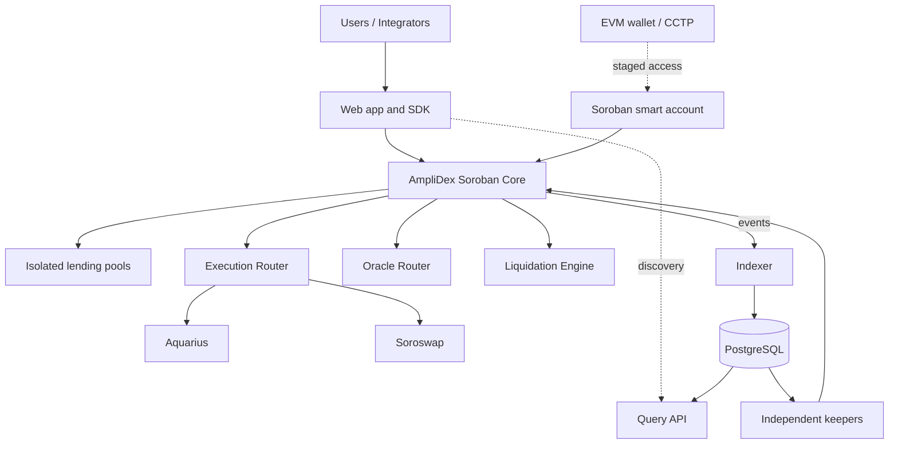

# Technical Architecture


This page is the GitBook edition of the canonical GitHub architecture. For line-by-line engineering review and contribution history, use the repository document.



[Canonical architecture document](../AMPLIDEX_TECHNICAL_ARCHITECTURE.md)


## Architecture map



## Core design

Stellar is the sole authority for liquidity, LP shares, debt, collateral, positions, fees, liquidation, and bad debt. Off-chain systems accelerate discovery and automation but never determine solvency.

The core contains tightly coupled economic accounting. DEXs and oracles sit behind narrow, governed adapters. Each market has isolated caps, a debt pool, route policy, oracle policy, margin parameters, and emergency controls. Unsafe price, route, liquidity, or cap conditions reject new exposure while risk-reducing actions remain available when safe.

## Economic lifecycle

1. An LP deposits assets and receives shares at the pre-deposit exchange rate.
2. A trader posts collateral and borrows from the applicable isolated pool.
3. The protocol executes through a registered route within user and protocol bounds.
4. Debt accrues through the pool borrow index.
5. Reference prices and executable close value determine conservative equity.
6. The owner repays or closes, or a permissionless actor settles an eligible liquidation.
7. Debt and interest return to the pool; explicit bad debt remains in its configured loss domain.

## Trust and failure boundaries

| Component | Authority | Failure behavior |
|---|---|---|
| Soroban contracts | canonical financial state | atomic revert on invalid transitions |
| Execution venues | bounded swap execution only | approved fallback or reject |
| Oracle sources | input observations | restrict new risk when stale/divergent |
| Indexer/API | history and discovery | clients refresh authoritative contract state |
| Keepers | candidate submission | other keepers or direct buyers retain access |
| CCTP | native USDC transport | Stellar-native protocol remains operational |
| Governance | timelocked configuration/upgrades | guardian can restrict risk, not seize funds |

## Security posture

Production safety depends on conservation and debt invariants, checked fixed-point arithmetic, explicit rounding, price freshness and deviation limits, end-state margin checks, least-privilege roles, deterministic artifacts, independent audits, keeper diversity, and capped rollout.

Every liquidation recomputes eligibility in the settlement transaction. Every adapter is allowlisted. Every privileged change emits an event. Every deployment maps a source commit to a reproducible WASM hash and configuration manifest.

## Staged extensions

EVM-controlled Soroban accounts and Circle CCTP add access and native USDC transport, not cross-chain position state. A successful mint followed by a failed trade leaves funds in the user-controlled account.

Confidential positions are a separate research and audit track. They require commitment-based state, replay-safe proof transitions, an independently reviewed verifier, and honest disclosure of remaining on-chain metadata. They do not inherit approval from the public protocol.

## Delivery sequence

```text
core economic hardening
→ replayable data platform and operations
→ multi-venue execution and resilient pricing
→ permissionless liquidation market
→ audited capped mainnet canary
→ separately reviewed cross-chain access
→ separately reviewed confidential-position option
```

For the complete economic model, threat analysis, governance design, verification plan, operations model, milestones, ADRs, and glossary, open the [canonical architecture document](../AMPLIDEX_TECHNICAL_ARCHITECTURE.md).
