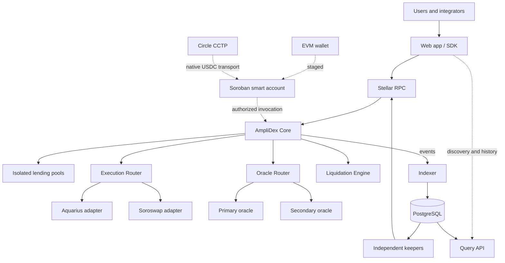
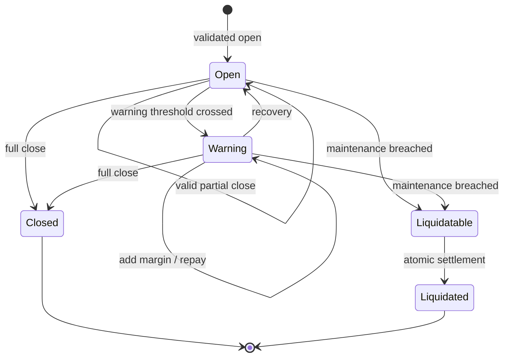

# AmpliDex Technical Architecture

## 1. Purpose and scope

AmpliDex is a non-custodial leveraged-markets and liquidity protocol designed for Soroban. Liquidity providers supply assets to isolated lending pools. Traders post collateral and borrow from those pools to create long or short exposure through approved Stellar execution venues. Interest accrues through pool borrow indexes; positions are continuously subject to deterministic solvency rules and permissionless liquidation.

The production design has five goals:

1. keep financial authority and settlement on Stellar;
2. isolate markets and external dependencies so failures are bounded;
3. make all privileged actions constrained, delayed, and observable;
4. preserve permissionless exits and liquidation wherever safe; and
5. allow EVM users to access Stellar-native positions without introducing backend custody.

The production release covers public positions, isolated pools, bounded execution, resilient pricing, liquidation, indexing, governance, and operations. EVM smart accounts, CCTP flows, and zero-knowledge confidentiality are staged extensions and must pass independent security gates before activation.

## 2. Scope and maturity

### 2.1 Capability register

| Capability                     | Current evidence stated in source | Production classification | Release gate                                  |
| ------------------------------ | --------------------------------- | ------------------------- | --------------------------------------------- |
| Lending pools and LP shares    | MVP validated                     | Core launch scope         | Economic audit and invariant tests            |
| Borrow-index accounting        | MVP validated                     | Core launch scope         | Rounding, overflow, and accrual tests         |
| Long and short positions       | MVP validated                     | Core launch scope         | Lifecycle and insolvency tests                |
| Add margin; partial/full close | MVP validated                     | Core launch scope         | State-machine and property tests              |
| Aquarius execution             | MVP validated                     | Core launch scope         | Adapter audit and mainnet route verification  |
| Keeper liquidation             | MVP validated                     | Core launch scope         | Independent keepers and race tests            |
| Soroswap and route failover    | Proposed extension                | Production hardening      | Integration tests and bounded fallback        |
| Dual-source oracle router      | Proposed extension                | Production hardening      | Freshness/deviation tests and incident drill  |
| Event indexer and query API    | Proposed extension                | Production hardening      | Replay, reconciliation, backup, and SLO tests |
| Direct liquidation market      | Proposed extension                | Post-core activation      | Economic review and capped rollout            |
| EVM-controlled smart accounts  | Proposed extension                | Staged extension          | Authentication audit                          |
| Circle CCTP integration        | Proposed extension                | Staged extension          | Recovery tests and supported-chain review     |
| Confidential positions         | Research direction                | Future opt-in feature     | Circuit benchmark and dedicated audit         |

“MVP validated” reflects the supplied project description. Before publication, link each claim to a repository tag, deployment, test report, or transaction record in [Appendix A](technical-architecture.md#appendix-a-evidence-register).

### 2.2 Non-goals for the initial release

* replicated leveraged state across multiple chains;
* arbitrary user-supplied DEX contracts, routes, or price feeds;
* backend custody or server-held user signing keys;
* uncapped or permissionless market listing;
* guaranteed LP liquidity during high utilization;
* complete transaction anonymity;
* unreviewed automatic upgrades;
* hidden socialization of bad debt.

## 3. System context



### 3.1 Trust boundaries

| Boundary          | Trusted for                                    | Explicitly not trusted for                        |
| ----------------- | ---------------------------------------------- | ------------------------------------------------- |
| Soroban contracts | balances, debt, solvency, settlement           | external prices without validation                |
| Governance        | bounded configuration and scheduled upgrades   | unilateral user-fund movement                     |
| Guardian          | narrowly defined emergency restrictions        | economic changes or balance mutation              |
| DEX adapters      | invoking a registered venue                    | defining risk or bypassing user bounds            |
| Oracles           | signed/reference observations                  | sole authority when stale or divergent            |
| Indexer/API       | discovery, history, analytics                  | authoritative balances or liquidation eligibility |
| Keepers           | candidate discovery and transaction submission | deciding whether a position is liquidatable       |
| Frontend/SDK      | transaction construction and simulation        | weakening contract validation                     |
| CCTP              | native USDC transport                          | synchronizing AmpliDex position state             |

## 4. Architecture principles

* **Single settlement domain.** Liquidity, debt, positions, fees, and liquidations settle on Stellar.
* **On-chain authority; off-chain acceleration.** Services improve access but cannot rewrite financial truth.
* **Fail closed for added risk.** Unsafe oracle, route, liquidity, or cap conditions reject new exposure.
* **Preserve risk reduction.** Margin addition, repayment, close, and liquidation remain available when they can be executed safely.
* **Least privilege.** Governance, guardian, deployer, keeper, and infrastructure identities are separate.
* **Deterministic execution.** Protocol assets interact only with registered adapters and bounded routes.
* **Market isolation.** Caps, debt pools, pricing, routes, and emergency controls are defined per market.
* **Atomicity and idempotency.** On-chain transitions are atomic; off-chain processing is replay-safe.
* **Measurable operations.** Safety signals have metrics, alerts, owners, and runbooks.

## 5. On-chain architecture

### 5.1 Contract topology

```
AmpliDex Core
├── Market Registry and configuration
├── Lending and LP accounting
├── Borrow and interest accounting
├── Position state machine
├── Risk evaluation
└── Settlement and fee accounting

Execution Router              Oracle Router
├── Aquarius adapter          ├── Primary oracle adapter
├── Soroswap adapter          ├── Secondary oracle adapter
└── governed route registry   └── validation policy

Liquidation Engine            Staged extensions
├── eligibility and quote     ├── Smart Account Factory
├── direct purchase           ├── EVM-controlled account
└── keeper settlement         └── ZK verifier/commitments
```

Accounting that shares invariants remains atomic in the core. Integrations are isolated behind narrow adapter interfaces. Whether these are separate deployed contracts or internal modules is a deployment decision; authorization and upgrade boundaries must be documented either way.

### 5.2 Canonical records

```
GlobalConfig                 protocol version, roles, fee recipient
MarketConfig(asset)          status, caps, margin, routes, oracle policy
PoolState(asset)             cash, borrows, reserves, shares, borrow index
LpBalance(asset, account)    share ownership
Position(position_id)        owner, market, side, collateral, debt, holdings, status
OwnerPosition(owner, ...)    bounded discovery index where practical
RouteConfig(route_id)        venue, adapter, path, limits, status
OraclePolicy(market)         sources, age, deviation, degraded behavior
```

Storage migrations are versioned, bounded, idempotent, and tested against serialized production snapshots. Existing enum variants are never reordered. Every deployment records the source commit, reproducible WASM hash, network, contract ID, migration version, and governance transaction.

### 5.3 Market configuration

Each market defines:

* enabled operations and emergency state;
* base/quote assets and decimal scales;
* borrow, utilization, position, and market-open-interest caps;
* maximum borrow multiplier;
* warning and maintenance margins;
* open, close, reserve, and liquidation fees;
* approved routes, hop limits, liquidity floors, and slippage limits;
* oracle sources, maximum age, deviation thresholds, and degraded-mode policy;
* minimum position and residual-position sizes.

Configuration updates validate internal ordering, for example `warning margin > maintenance margin`, and may not retroactively mutate user balances.

## 6. Economic model

### 6.1 Pool and LP accounting

For an established pool, deposits mint shares using the pre-deposit exchange rate:

```
shares_minted = floor(deposit_assets × total_shares / total_assets_before)
```

Redemption value is:

```
assets_owned = floor(user_shares × total_assets / total_shares)
available_cash = token_balance - reserved_outflows
assets_redeemed <= min(assets_owned, available_cash)
```

The implementation must define empty-pool initialization, donation handling, minimum initial liquidity, rounding direction, dust, fee-on-transfer rejection, and behavior when losses reduce the exchange rate. UI copy must distinguish economic ownership from immediately withdrawable liquidity.

### 6.2 Debt and interest

Debt is represented with a pool-level index:

```
scaled_debt = ceil(borrow_amount × INDEX_SCALE / borrow_index_at_borrow)
current_debt = ceil(scaled_debt × current_borrow_index / INDEX_SCALE)
```

Interest accrual is bounded by elapsed-time and arithmetic limits. Borrow and repayment round conservatively so debt cannot disappear through truncation. Accrual occurs before every operation that reads or mutates pool debt.

Utilization and a kinked annualized borrow-rate model are conceptually:

```
U = total_borrowed / total_assets

if U <= U_optimal:
  rate = base + slope_1 × U / U_optimal
else:
  rate = base + slope_1 + slope_2 × (U - U_optimal) / (1 - U_optimal)

supply_rate ≈ borrow_rate × U × (1 - reserve_factor)
```

Exact time basis, compounding convention, fixed-point scale, and maximum rate are part of the economic specification and test vectors—not implicit implementation details.

### 6.3 Leverage semantics

AmpliDex uses **borrow multiplier**, not gross-exposure multiplier:

```
borrowed_notional = collateral × borrow_multiplier
approximate long gross exposure = collateral + borrowed_notional
```

The contract, SDK, interface, and disclosures use this terminology consistently.

### 6.4 Position state machine



A long borrows USDC and acquires the market asset. A short borrows the market asset and sells it for USDC. Every open or increase validates caps, pool capacity, price environment, route bounds, post-trade holdings, and resulting margin in one atomic transaction.

Partial close allocates collateral, holdings, debt, and fees using explicitly tested rounding rules. It rejects a residual position that is dust-sized, structurally invalid, above caps, or immediately liquidatable. Full close repays current debt and fees, releases the surplus to the owner, and permanently closes the position record.

### 6.5 Risk calculation

Risk uses the more conservative of valid reference value and realizable route value, after costs:

```
long equity = conservative_sale_value(held_asset) + collateral - current_debt - close_costs
short equity = proceeds + collateral - conservative_repurchase_cost(current_debt_asset) - close_costs
margin_ratio = equity / exposure
```

The formal economic specification must define exposure, negative equity, fee priority, rounding, threshold equality, and behavior when no executable quote exists. The contract—not the indexer, keeper, or UI—makes the final state determination.

## 7. Execution and pricing

### 7.1 Execution Router

The core invokes only routes registered by governance. A route binds the expected market, direction, adapter, venue, path, maximum hops, expiry, liquidity floor, slippage ceiling, and priority. Adapters expose narrow exact-input and exact-output quote/execute operations.

A transaction succeeds only if the selected route:

* is enabled and maps the expected input/output assets;
* stays within user-signed maximum input or minimum output;
* stays within protocol slippage and price-deviation bounds;
* has a fresh quote and meets configured liquidity requirements; and
* returns an amount validated from actual balance deltas.

Fallback happens across separately simulated/signed attempts unless the entire path is safely atomic. A retry may change to another approved route but cannot loosen user or protocol bounds.

### 7.2 Oracle Router

The protocol distinguishes:

* **reference price:** an independent, freshness-checked observation used for solvency and circuit breakers; and
* **executable price:** a conservative approved-route quote used to estimate realizable settlement.

Sources are normalized to a documented scale, checked for timestamp/ledger freshness, and compared against one another and executable quotes. Material disagreement is not averaged away.

| Price condition         |               Open/increase | Add margin/repay |                     Close |                 Liquidation |
| ----------------------- | --------------------------: | ---------------: | ------------------------: | --------------------------: |
| Healthy sources         |                     Enabled |          Enabled |                   Enabled |                     Enabled |
| One source stale        | Restricted by market policy |          Enabled | Conservative route bounds |         Conservative policy |
| Material disagreement   |                    Disabled |          Enabled |   Risk-reducing path only |    Restricted/manual policy |
| All sources unavailable |                    Disabled |          Enabled |     Emergency exit policy | Predefined emergency policy |

Exact behavior is market-specific and configured before activation. Oracle incidents must never silently substitute an unbounded spot price.

## 8. Liquidation and bad debt

Eligibility is recalculated atomically at settlement. A keeper or liquidation buyer can submit a candidate, but cannot force a healthy position to liquidate.

The liquidation quote binds position/version, payment required, debt principal and interest, fees/incentive, collateral delivered, reference price, effective price, quote ledger, and expiry. The buyer signs maximum payment and minimum collateral received. Settlement rechecks eligibility and all bounds, collects payment, repays the pool, distributes only permitted fees, returns residual surplus to the owner, and marks the position liquidated.

Multiple independent keepers provide liveness if no direct buyer participates. Keeper keys hold only limited operating balances and no governance power.

Bad debt is recognized only after position-held assets and collateral are exhausted:

```
position assets → collateral → designated insurance (if enabled) → affected pool loss
```

Losses are explicit in state and events. They are not silently assigned to unrelated pools. Any insurance reserve has transparent balances, per-market/global caps, and epoch payout limits.

## 9. Off-chain platform

### 9.1 Indexer and API

Contract events feed a replayable indexer with a durable ledger checkpoint. Event rows use deterministic identities such as `(network, transaction_hash, event_index)`. Event writes and checkpoint advancement occur in one database transaction.

The indexer supports account positions, pools, market history, liquidations, and protocol metrics. It recovers from the last finalized checkpoint, tolerates duplicate delivery, handles supported chain reorganization semantics, and periodically reconciles materialized views against contract reads.

The query API is versioned (`/v1`), paginated, rate-limited, cache-aware, and read-only for authoritative financial state. Quote endpoints are advisory; all transactions are simulated and validated again on-chain.

### 9.2 Frontend and SDK

The non-custodial client handles wallet connection, read discovery, authoritative contract refresh, transaction simulation, signing, and lifecycle feedback. It never asks a backend to sign for a user.

Data precedence is:

1. contract state for balances, debt, configuration, and eligibility;
2. current simulation for transaction-specific effects and resource costs;
3. indexed data for discovery, history, and analytics.

SDK modules cover markets, pools, positions, liquidation, simulation, contract bindings, smart accounts, and CCTP. Generated bindings are pinned to contract versions, and clients fail clearly on incompatible protocol versions.

## 10. Cross-chain access (staged)

An EVM-controlled Soroban smart account may hold Stellar assets and authorize scoped Soroban invocations after verifying an EVM signature. An authorization binds the EVM signer, Stellar network passphrase, account address, target contract, invocation tree/hash, nonce, validity window, and account implementation version. Nonces are single-use; signer rotation and recovery are explicit privileged flows.

CCTP transports native USDC to or from the user-controlled Stellar account. It does not transport positions or debt. The bridge and trade are separate state machines:

```
source approval/burn → message finality → attestation → destination mint → user balance
user balance → separately simulated and signed AmpliDex operation
```

If the destination mint succeeds and trading fails, funds remain recoverable by the user: they can retry, hold, transfer, or bridge out. Relayers may pay fees but never gain spending authority. Supported domains, finality assumptions, message uniqueness, duplicate handling, and recovery procedures are documented per integration release.

## 11. Confidential positions (research track)

Confidentiality requires commitment-based position state and proof-constrained transitions; encrypted frontend data alone is insufficient. Candidate private fields include collateral, debt, leverage, entry price, holdings, and margin. Market, state version, commitment, proof policy, and nullifier state may remain public.

Each proof binds the network, protocol contract, position ID, prior commitment, operation, new commitment, nonce/nullifier, oracle inputs, and validity window. Circuits must preserve the same accounting, ownership, solvency, and liquidation rules as public positions.

This work is explicitly staged:

1. private intent / commit-reveal;
2. confidential position state;
3. additional execution privacy research.

No claim of transaction anonymity is made while token transfers, DEX interactions, timing, or access patterns remain observable. Proof-system selection follows benchmarks for Soroban verification cost, proof size, browser prover time/memory, setup assumptions, tooling, and auditability. Activation requires a dedicated circuit and verifier audit.

## 12. Governance and upgrade safety

Production control consists of a governance multisig or governor, a timelock, and a restricted emergency guardian.

| Role       | Permitted                                                                               | Prohibited                                                                     |
| ---------- | --------------------------------------------------------------------------------------- | ------------------------------------------------------------------------------ |
| Governance | schedule upgrades; add markets; update timelocked parameters; register adapters/oracles | bypassing contract invariants or seizing balances                              |
| Guardian   | pause new risk; disable a market, route, or oracle                                      | moving funds; changing fees; liquidating healthy positions; arbitrary upgrades |
| Deployer   | execute approved deployment procedure                                                   | ongoing economic control after handoff                                         |
| Keeper     | submit public operations                                                                | configuration or upgrade authority                                             |

Emergency states are granular: `NORMAL`, `NEW_EXPOSURE_PAUSED`, `MARKET_RESTRICTED`, `ROUTE_RESTRICTED`, `ORACLE_RESTRICTED`, `LIQUIDATION_ONLY`, and `EMERGENCY_EXIT`. State transitions emit events and have runbook owners.

Upgrades follow proposal, public review, security-delta review, timelock, execution, and post-deployment verification. Storage migration and rollback/forward-fix procedures are rehearsed on a production-state snapshot. Critical roles use threshold hardware-backed custody and documented rotation.

## 13. Security model

### 13.1 Critical invariants

1. LP shares cannot create value through deposit/withdraw rounding.
2. Withdrawals cannot exceed ownership or available pool cash.
3. Accrued debt cannot decrease except through repayment, settlement, or explicit loss accounting.
4. Borrowing cannot exceed pool, asset, market, or position limits.
5. An opened or increased position cannot be immediately liquidatable.
6. Partial close cannot leave invalid or unaccounted state.
7. Only registered adapters and bounded routes can move protocol-managed trade assets.
8. Stale or conflicting price conditions cannot create new leverage.
9. Liquidation eligibility is recomputed in the settlement transaction.
10. Fees cannot consume unrelated LP principal or exceed configured/economic limits.
11. Bad debt is explicit and isolated to the configured loss domain.
12. Indexed/API state cannot authorize a financial transition.
13. EVM authorizations and ZK proofs cannot replay across nonce, account, contract, or network domains.
14. A failed operation after CCTP mint leaves funds under user control.
15. Privileged actors cannot arbitrarily transfer user or LP balances.

### 13.2 Threats and controls

| Threat                            | Primary controls                                                            | Residual risk / response                                  |
| --------------------------------- | --------------------------------------------------------------------------- | --------------------------------------------------------- |
| DEX manipulation or low liquidity | independent price checks, route allowlist, caps, slippage, liquidity floors | restrict route/market; conservative close                 |
| Oracle compromise/staleness       | multiple sources, freshness, deviations, circuit breakers                   | stop new risk; apply predeclared degraded mode            |
| Insolvency from volatility        | conservative margins, caps, liquidation incentives, keeper diversity        | explicit bad debt and pool-isolated loss                  |
| Flash-loan/composability attack   | end-state checks, conservative price windows, re-entrancy-safe ordering     | transaction and economic simulation                       |
| Malicious token/adapter           | asset onboarding review, adapter allowlist, balance-delta checks            | disable integration; isolate affected market              |
| Keeper outage/censorship          | permissionless submissions, direct buyer market, multiple operators         | alert and start independent fallback workers              |
| Governance compromise             | multisig, timelock, narrow guardian, public upgrade hashes                  | pause new exposure; rotate compromised role               |
| Smart-account replay              | full domain separation, nonce, expiry, invocation scope                     | disable staged access path without affecting native users |
| Indexer/RPC corruption            | reconciliation, redundant providers, on-chain revalidation                  | mark data stale; fail transaction preparation safely      |
| CCTP partial completion           | explicit state machine, idempotency, user-controlled destination            | recovery workflow and independent status checks           |
| ZK circuit/verifier flaw          | public fallback, staged caps, formal review, dedicated audit                | disable private mode without changing public positions    |

All financial arithmetic uses checked integers/fixed point, normalized decimals, overflow-safe `mul_div`, specified rounding directions, and no floating point. Asset callbacks or re-entrant invocation paths are treated as hostile. Authorization follows checks-effects-interactions where applicable.

## 14. Verification and assurance

### 14.1 Test strategy

* **Unit:** interest, index, shares, fees, decimals, margins, slippage, and errors.
* **Property:** conservation, monotonic debt, no rounding extraction, bounds never loosen, healthy positions cannot liquidate.
* **Stateful fuzz:** long operation sequences, repeated partial closes, extreme time jumps, caps, dust, mixed decimals, and loss events.
* **Integration:** every DEX/oracle adapter, primary failure/fallback, RPC failure, event replay, reconciliation, and upgrade migration.
* **Adversarial:** manipulated prices, stale sources, front-running, keeper/buyer races, signature replay, malicious tokens, and resource exhaustion.
* **End-to-end:** testnet lifecycle from deposit through close/liquidation, including monitoring and runbook drills.

CI blocks merge on formatting, linting, tests, known-vulnerability policy, contract build, generated-binding drift, and reproducible artifact checks. Coverage is a supporting signal, not a substitute for invariant and adversarial tests.

### 14.2 Independent review

Required reviews are independently scoped:

1. core economics and contract state transitions;
2. DEX and oracle integrations;
3. governance, upgrade, and emergency authorization;
4. EVM smart-account authentication before that feature activates;
5. CCTP flow and recovery before cross-chain launch; and
6. circuits, verifier, and metadata model before confidential mode.

Critical/high findings are fixed and retested before activation. Audit reports, commit hashes, fixes, and residual accepted risks are public. A vulnerability disclosure policy and funded bug-bounty program are live before uncapped mainnet operation.

## 15. Reliability, observability, and operations

Suggested service objectives are targets to validate during load and failure testing:

| Component / signal                     | Initial objective                                   |
| -------------------------------------- | --------------------------------------------------- |
| Public web and read API availability   | 99.9% monthly                                       |
| Indexer lag under normal load          | fewer than 3 ledgers                                |
| Indexer recovery point                 | last finalized/checkpointed ledger                  |
| Keeper candidate-to-submission latency | market-specific; alert before safety budget expires |
| Critical on-call alert dispatch        | under 2 minutes                                     |
| Database recovery                      | point-in-time recovery with restore drills          |
| Backend dependency for solvency        | none                                                |

Metrics include pool cash/borrows/utilization, debt accrual, open interest, margin distribution, liquidations, bad debt, route errors/slippage/fallbacks, oracle age/deviation, indexer lag/reconciliation, keeper balances/heartbeats, RPC health, and CCTP state duration. Alerts have severity, owner, threshold, escalation, and linked runbook.

Runbooks cover oracle divergence, DEX/adapter failure, abnormal utilization, liquidation backlog, bad debt, RPC outage, indexer rebuild, database recovery, compromised keys, governance incident, contract upgrade failure, CCTP delay, and frontend compromise. Teams rehearse high-severity scenarios before increasing caps.

Secrets are stored in managed secret systems. Governance and upgrade keys use hardware-backed threshold custody; deployer authority is removed or minimized after handoff. Keeper and CI credentials are scoped, rotated, and monitored. Backups are encrypted and restoration is tested.

## 16. Deployment and release

```
reviewed change
→ deterministic build and artifact hash
→ unit/property/fuzz/integration gates
→ testnet deployment and end-to-end validation
→ security-delta approval
→ governance proposal and timelock
→ capped mainnet canary
→ post-deployment verification
→ observation window
→ evidence-based cap increase
```

The initial mainnet configuration uses few markets, low leverage and borrow caps, conservative utilization, strict oracle deviation, limited routes, and at least two independently operated keepers. Caps increase only after predefined observation periods and measured execution, oracle, utilization, liquidation, and incident criteria.

Release artifacts include source tag, SBOM/dependency lockfiles, compiler/toolchain versions, WASM hash, contract IDs, configuration manifest, migration manifest, test summary, audit references, signer approval, and rollback/forward-fix plan.

## 17. Delivery roadmap and grant milestones

| Milestone                     | Deliverables                                                                          | Objective acceptance evidence                                                       |
| ----------------------------- | ------------------------------------------------------------------------------------- | ----------------------------------------------------------------------------------- |
| M1 — Core hardening           | formal economic spec, invariants, expanded tests, governance roles, migration tooling | CI reports; invariant suite; reproducible testnet artifact; independent core review |
| M2 — Data and operations      | canonical events, replayable indexer, API, reconciliation, dashboards, runbooks       | recovery/replay demo; reconciliation report; load and restore tests                 |
| M3 — Execution and pricing    | router, Aquarius/Soroswap adapters, dual-source pricing, circuit breakers             | failure/fallback tests; stale/divergent oracle tests; adapter review                |
| M4 — Liquidation              | deterministic quotes, direct purchase, keeper redundancy, bad-debt accounting         | threshold/race tests; testnet settlement evidence; incident drill                   |
| M5 — Capped production        | audited release, timelock, monitored canary, disclosure and bounty programs           | deployment manifest; audit/fix links; live dashboards; canary report                |
| M6 — Cross-chain access       | EVM smart accounts, factory, CCTP ingress/egress, recovery UX                         | authentication review; replay suite; end-to-end recovery evidence                   |
| M7 — Confidentiality research | threat model, benchmarks, commitments/circuits, verifier prototype                    | benchmark report; public test vectors; dedicated audit before activation            |

Grant reporting should attach a repository tag, deployed contract ID, test output, demo transaction, and short acceptance report to each completed milestone. Funding should be associated with measurable artifacts rather than feature descriptions alone.

## 18. Production readiness gates

A market is not production-ready until all applicable boxes are evidenced:

* [ ] economic specification and parameter rationale approved;
* [ ] all critical invariants represented in automated tests;
* [ ] stateful fuzzing and mixed-decimal/rounding tests pass;
* [ ] migrations pass against a production-shaped snapshot;
* [ ] DEX routes and oracle sources are independently verified;
* [ ] degraded-mode and emergency-exit behavior is tested;
* [ ] keeper redundancy and liquidation race tests pass;
* [ ] event replay, reconciliation, backup, and restore drills pass;
* [ ] multisig, timelock, guardian limits, and key rotation are verified;
* [ ] independent audit findings are resolved or publicly accepted;
* [ ] monitoring, paging, and incident runbooks are live;
* [ ] contract IDs, source commit, WASM hashes, and configuration are published;
* [ ] vulnerability disclosure and bug-bounty processes are operational;
* [ ] capped launch criteria and rollback/forward-fix authority are approved.

Cross-chain and confidential-position features have separate gates and may not inherit approval from the core protocol.

## 19. Architecture decisions

| ID      | Decision                                              | Rationale                                                           |
| ------- | ----------------------------------------------------- | ------------------------------------------------------------------- |
| ADR-001 | Stellar is the sole financial settlement domain       | avoids fragmented solvency and cross-chain position synchronization |
| ADR-002 | CCTP transports USDC, not protocol state              | contains cross-chain failure and preserves user recovery            |
| ADR-003 | The indexer is non-authoritative                      | keeps solvency independent of backend availability                  |
| ADR-004 | Execution routes are governed and bounded             | prevents arbitrary external invocation with protocol assets         |
| ADR-005 | Material oracle disagreement restricts risk           | avoids manufacturing confidence by averaging conflicting data       |
| ADR-006 | Direct liquidation plus keeper fallback               | broadens participation while preserving automation and liveness     |
| ADR-007 | EVM users control Soroban smart accounts              | brings external identity to Stellar without backend custody         |
| ADR-008 | Confidentiality is staged and opt-in                  | separates reviewed public economics from higher-risk cryptography   |
| ADR-009 | Markets are isolated by configuration and loss domain | limits contagion and makes risk measurable                          |

## 20. Repository and documentation topology

```
amplidex/
├── contracts/                 core, routers, accounts, verifier
├── packages/                  SDK, bindings, shared types
├── apps/                      web, API, indexer, keeper
├── circuits/                  staged confidential-position circuits
├── deployments/               immutable per-network manifests
├── docs/
│   ├── architecture/
│   ├── adr/
│   ├── economics/
│   ├── security/
│   └── runbooks/
└── tests/                     property, fuzz, integration, end-to-end
```

Normative economic rules live in a versioned specification; operational instructions live in runbooks; design changes receive ADRs. This document remains the system-level map and links to those sources rather than duplicating mutable deployment facts.

## Appendix A: Evidence register

Replace `TBD` before making implementation or production claims in an application.

| Evidence                               | Reference          |
| -------------------------------------- | ------------------ |
| Source repository and production tag   | TBD                |
| MVP/testnet contract IDs and network   | TBD                |
| Mainnet contract IDs                   | Not deployed / TBD |
| Reproducible WASM hashes               | TBD                |
| Automated test report                  | TBD                |
| Economic specification                 | TBD                |
| Audit report and remediation commit    | TBD                |
| Deployment/configuration manifest      | TBD                |
| Monitoring status page                 | TBD                |
| Vulnerability disclosure / bug bounty  | TBD                |
| Governance signers and timelock policy | TBD                |

## Appendix B: Reviewer questions

1. Where are authoritative cash, debt, shares, and position state stored?
2. What precise rounding rules apply to every asset/debt conversion?
3. Can an unavailable route or oracle ever increase risk?
4. Can any privileged role move user funds or bypass a timelock?
5. What prevents a healthy position from being liquidated?
6. Which loss domain absorbs bad debt, and how is it reported?
7. Can users close or recover funds when each external dependency fails?
8. How does the indexer rebuild and prove reconciliation?
9. Which evidence supports each “implemented,” “tested,” “audited,” or “production” claim?
10. What measurable condition permits each launch-cap increase?

## Appendix C: Glossary

| Term              | Meaning                                                                              |
| ----------------- | ------------------------------------------------------------------------------------ |
| Borrow multiplier | borrowed notional divided by posted collateral                                       |
| Gross exposure    | collateral-funded exposure plus borrowed exposure, before fees and execution effects |
| Reference price   | independent price observation used for validation and risk controls                  |
| Executable price  | conservative value available through an approved route                               |
| Scaled debt       | debt units normalized by the pool borrow index                                       |
| Liquidation buyer | permissionless participant that settles a qualifying position under bounded terms    |
| Keeper            | untrusted automation that discovers and submits eligible operations                  |
| Guardian          | restricted emergency role that can reduce risk but cannot seize funds                |
| CCTP              | Circle Cross-Chain Transfer Protocol for native USDC movement                        |

***

This architecture makes AmpliDex a Stellar-native leveraged credit and execution protocol: pools fund positions, approved venues execute exposure, deterministic pricing and margin rules bound risk, and permissionless settlement returns debt to the appropriate pool. Production readiness is demonstrated through published artifacts, independent review, capped deployment, and measurable operations—not by architecture language alone.
